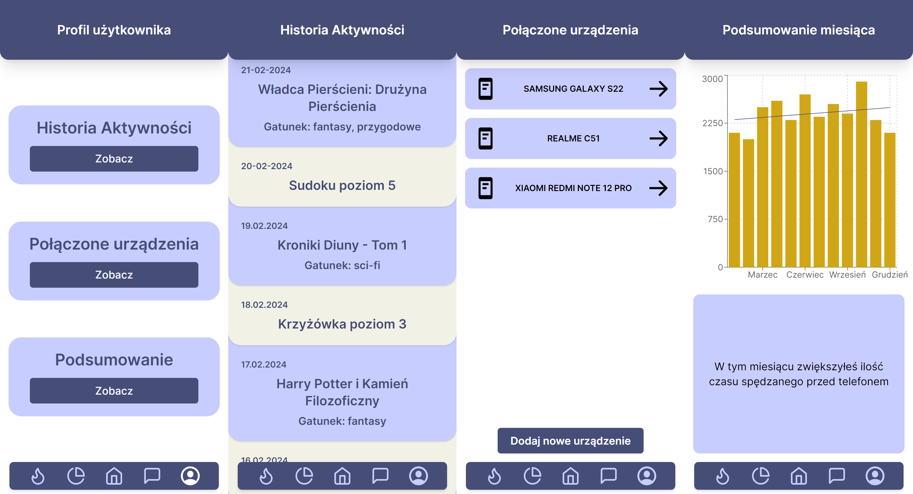

# Stop Scrolling

**Stop Scrolling** is our solution for confrontation with addictions

## Motivation
Stop Scrolling was created at [BITEHack](https://bitehack.best.krakow.pl/) Hackathon.

- **Topic:** Confrontation with addictions

- Timeframe: 20-21 January 2024, 24 hours

## Tech Stack

### Client

## Screenshots

## Authors

- [@BPajda](https://github.com/BPajda)
- [@CALLmeDOMIN](https://github.com/CALLmeDOMIN)
- [@LukaSparrow ](https://github.com/LukaSparrow )
- [@rubikon02](https://github.com/rubikon02)

## License

This project is licensed under [MIT](./LICENSE) license.
